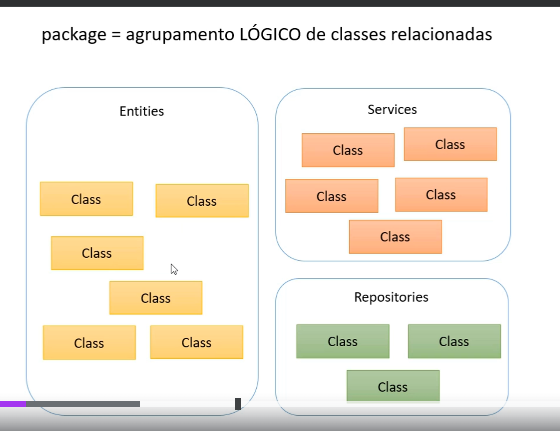

### CURSO UDEMY (JAVA)

Link: https://www.udemy.com/course/java-curso-completo/?couponCode=ACCAGE0923

### AULAS ASSISTIDAS
Observação - iniciado na seção 03 (Introdução à linguagem Java)
```
10/set:  1, 10, 11, 12, 13, 14, 18, 19, 20, 21, 22, 23
11/set: 23, 24, 25, 26, 27, 28
12/set: 31 - 41
------
19/set: 57, 58, 59 60, 61
20/set: 62 - 79
```

LTS - LONGTERM SUPPORT
https://www.oracle.com/br/java/technologies/java-se-support-roadmap.html

JAVA ME - JAVA MICRO EDITION - dispositivos embarcados e móveis
JAVA SE - JAVA STANDART EDITION - desktop e servidores
JAVA EE - JAVA ENTERPRISE EDITION - aplicações corporativas

JVM - JAVA VIRTUAL MACHINE

Class > Package > Modulo > Aplicação

